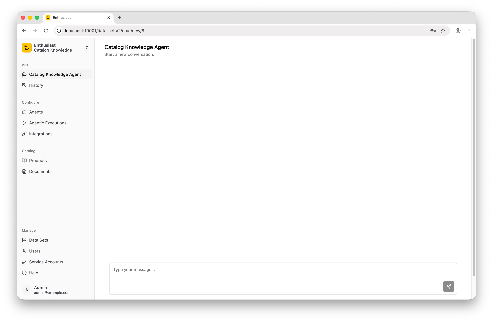

# Creating a Custom Agent

A custom agent lets you define exactly which tools the agent has access to and how it should behave, while Enthusiast takes care of building and running it.

## Example: Catalog Knowledge Agent

This example walks through building the **Catalog Knowledge Agent** — an agent that can answer questions about both products in the catalog and information from uploaded documents (service descriptions, policies, FAQs, etc.).

In practice, this agent combines the functionality of two of Enthusiast's pre-built agents: the [Product Search agent](/agents/product-search) and the [User Manual Search agent](/agents/user-manual-search). To see what else is available out of the box, visit the [Pre-built Agents](/agents) page.

### How it works

The agent's knowledge comes entirely from tools we attach to it. Each tool receives Enthusiast's default **injector**, which provides a product retriever and a document retriever out of the box — giving tools direct access to the catalog and document store without any extra wiring. See [Injector](/docs/agents/injector) for more details.

**Products — two tools**

Products are queried using SQL against the product catalog table. Because the agent generates the SQL itself, it first needs to understand the shape of the data: what columns exist and what values they contain. That is what `ProductCatalogSampleTool` is for — it fetches a representative sample so the agent can construct valid queries. `ProductSearchTool` then executes the actual natural-language-to-SQL lookup. Two tools are needed because the agent would otherwise have no basis for writing a correct query.

**Documents — one tool**

Documents are stored as vector embeddings and retrieved by semantic similarity. The agent simply passes the user's question to `DocumentRetrievalTool`, which uses the embedding-based retriever to find the closest matching chunks. No schema knowledge is required upfront, so one tool is sufficient.

### Folder structure

```
catalog_knowledge_agent/
├── __init__.py
├── agent.py
├── config.py
├── prompt.py
└── tools/
    ├── __init__.py
    ├── document_retrieval_tool.py
    ├── product_catalog_sample_tool.py
    └── product_search_tool.py
```

### 1. Define the agent (`agent.py`)

```python
from enthusiast_agent_tool_calling import BaseToolCallingAgent
from enthusiast_common.config.base import LLMToolConfig

from .tools import DocumentRetrievalTool, ProductCatalogSampleTool, ProductSearchTool


class CatalogKnowledgeAgent(BaseToolCallingAgent):
    AGENT_KEY = "enthusiast-agent-catalog-knowledge"
    NAME = "Catalog Knowledge Agent"
    TOOLS = [
        LLMToolConfig(tool_class=ProductCatalogSampleTool),
        LLMToolConfig(tool_class=ProductSearchTool),
        LLMToolConfig(tool_class=DocumentRetrievalTool),
    ]
```

### 2. Write the system prompt (`prompt.py`)

```python
CATALOG_KNOWLEDGE_AGENT_SYSTEM_PROMPT = """
You are a helpful assistant with access to a product catalog and a library of documents (such as service descriptions, policy documents, and FAQs).

When answering a question:
- If the question is about what products or services are available, start by using the product_catalog_sample tool to understand what the catalog contains, then use product_search to find relevant products.
- If the question is about the details, terms, features, or policies of a product or service, use the document_retrieval tool to find relevant information from documents.
- For questions that may involve both (e.g. writing promotional content or customer support responses), use both tools.

Always base your answers on what the tools return. Do not make up details about products or services.
"""
```

### 3. Create the tools

#### `tools/product_catalog_sample_tool.py`

Returns a sample of products from the catalog. The agent uses this first to understand what is available before running a targeted search.

```python
import textwrap

from enthusiast_common.injectors import BaseInjector
from enthusiast_common.tools import BaseLLMTool
from langchain_core.language_models import BaseLanguageModel
from pydantic import BaseModel


class ProductCatalogSampleToolInput(BaseModel):
    pass


class ProductCatalogSampleTool(BaseLLMTool):
    NAME = "product_catalog_sample"
    DESCRIPTION = "Returns a representative sample of products from the catalog. Use this first to understand what kinds of products and services are available before performing a targeted search."
    ARGS_SCHEMA = ProductCatalogSampleToolInput
    RETURN_DIRECT = False

    def __init__(
        self,
        data_set_id: int,
        llm: BaseLanguageModel,
        injector: BaseInjector,
    ):
        super().__init__(data_set_id=data_set_id, llm=llm, injector=injector)

    def run(self):
        product_retriever = self._injector.product_retriever
        sample_products = product_retriever.get_sample_products_json()
        response = f"""
            Here is a sample of products available in the catalog:
            {sample_products}
            Use the product_search tool to find products that match the user's specific query.
        """
        return textwrap.dedent(response)
```

#### `tools/product_search_tool.py`

Searches the product catalog using a natural-language description.

```python
import json

from enthusiast_common.injectors import BaseInjector
from enthusiast_common.tools import BaseLLMTool
from langchain_core.language_models import BaseLanguageModel
from pydantic import BaseModel, Field


class ProductSearchToolInput(BaseModel):
    query: str = Field(description="A natural-language description of the product or service to search for.")


class ProductSearchTool(BaseLLMTool):
    NAME = "product_search"
    DESCRIPTION = "Searches the product catalog using a natural-language description and returns matching products. Use this to find specific products or services that meet the user's criteria."
    ARGS_SCHEMA = ProductSearchToolInput
    RETURN_DIRECT = False

    def __init__(
        self,
        data_set_id: int,
        llm: BaseLanguageModel,
        injector: BaseInjector,
    ):
        super().__init__(data_set_id=data_set_id, llm=llm, injector=injector)

    def run(self, query: str) -> str:
        product_retriever = self._injector.product_retriever
        relevant_products = product_retriever.find_products_matching_query(query)
        if not relevant_products:
            return "No products found matching the query. Try rephrasing or broadening the search."

        serialized = product_retriever.product_details_as_json(relevant_products)
        return json.dumps(serialized)
```

#### `tools/document_retrieval_tool.py`

Retrieves relevant content from uploaded documents (manuals, policies, FAQs, etc.).

```python
from enthusiast_common.injectors import BaseInjector
from enthusiast_common.tools import BaseLLMTool
from langchain_core.language_models import BaseLanguageModel
from pydantic import BaseModel, Field


class DocumentRetrievalToolInput(BaseModel):
    full_user_request: str = Field(description="user's full request")


class DocumentRetrievalTool(BaseLLMTool):
    NAME = "document_retrieval"
    DESCRIPTION = "Use it to get context from documents required for answering questions"
    ARGS_SCHEMA = DocumentRetrievalToolInput
    RETURN_DIRECT = False

    def __init__(
        self,
        data_set_id: int,
        llm: BaseLanguageModel,
        injector: BaseInjector,
    ):
        super().__init__(data_set_id=data_set_id, llm=llm, injector=injector)
        self.data_set_id = data_set_id
        self.llm = llm
        self.injector = injector

    def run(self, full_user_request: str):
        document_retriever = self.injector.document_retriever
        relevant_documents = document_retriever.find_content_matching_query(full_user_request)
        content = [document.content for document in relevant_documents]

        return content
```

#### `tools/__init__.py`

```python
from .document_retrieval_tool import DocumentRetrievalTool
from .product_catalog_sample_tool import ProductCatalogSampleTool
from .product_search_tool import ProductSearchTool

__all__ = ["DocumentRetrievalTool", "ProductCatalogSampleTool", "ProductSearchTool"]
```

### 4. Create the config provider (`config.py`)

```python
from enthusiast_common.agents import BaseAgentConfigProvider, ConfigType
from enthusiast_common.config import AgentConfigWithDefaults

from .agent import CatalogKnowledgeAgent
from .prompt import CATALOG_KNOWLEDGE_AGENT_SYSTEM_PROMPT


class CatalogKnowledgeConfigProvider(BaseAgentConfigProvider):
    def get_config(self, config_type: ConfigType = ConfigType.CONVERSATION) -> AgentConfigWithDefaults:
        return AgentConfigWithDefaults(
            system_prompt=CATALOG_KNOWLEDGE_AGENT_SYSTEM_PROMPT,
            agent_class=CatalogKnowledgeAgent,
            tools=CatalogKnowledgeAgent.TOOLS,
        )
```

### 5. Expose the agent from the package (`__init__.py`)

The agent registry discovers the agent class and config provider by scanning the package's top-level namespace, so both must be exported here.

```python
from .agent import CatalogKnowledgeAgent
from .config import CatalogKnowledgeConfigProvider

__all__ = ["CatalogKnowledgeAgent", "CatalogKnowledgeConfigProvider"]
```

### 6. Register the agent in `settings_override.py`

```python
AVAILABLE_AGENTS = ['catalog_knowledge_agent.CatalogKnowledgeAgent']
```

The agent is now available in the UI.


